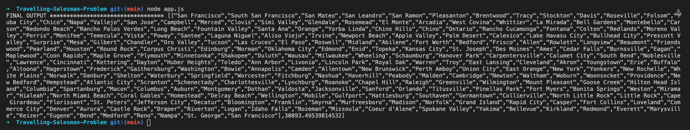

# Travelling-Salesman-Problem

## General Thoughts

The travelling salesman problem was something I learnt during my undergrad degree so it was fun trying to crack the np-hard problem that has baffled 
everyone for a long time. The way I tackled this problem was to first to parse the data from the CSV into a JSON format that I can work with. Once getting the JSON data, I implemented Dijkstra's algorithm which is a greedy algorithm that chooses the shortest path from the origin city in the alloted time.

If I had more time I would have looked in swaping 2 random cities and seeing if the overall distance decreases in the new path. If the swap is better, then I would keep the results and preform more random swaps.

I overall learnt a lot about vanilla javascript as I am  mostly familiar with javascript frameworks such as React and Vue and this was a great opportunity to sharpen my vanilla javascript knowledge/skills. I made some assumptions in this project like not bieng allowed to use libaries such as csvToJSON which would have made it a lot easier.

## Getting Started

1. Fork this repository, then clone it.
2. Install the dependencies using the `npm install` command.
3. run the app.js by using the `node app.js` command. to view the result.
 
## Final Result

